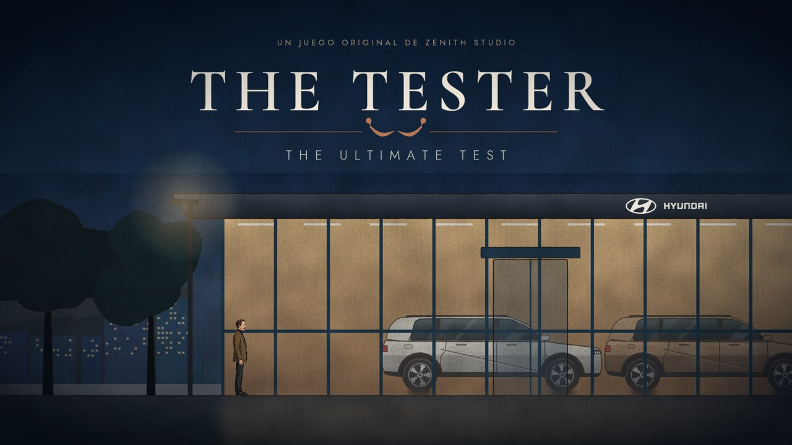
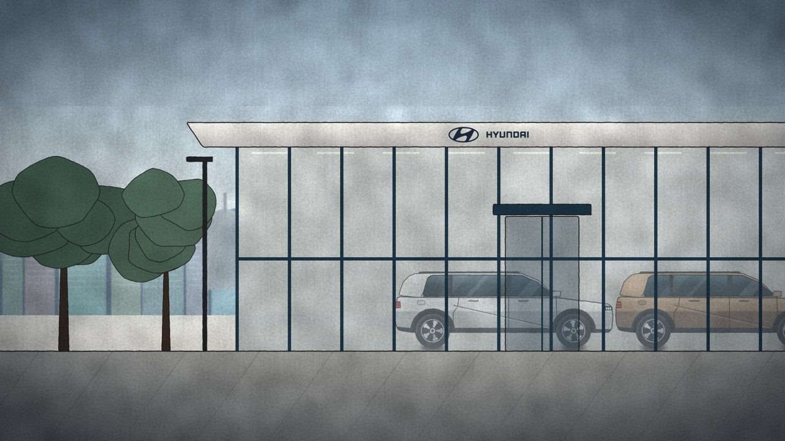
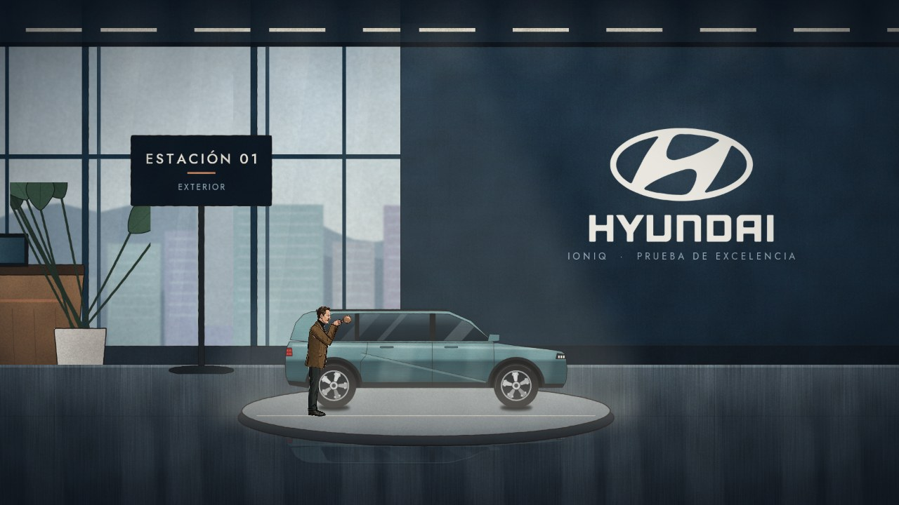
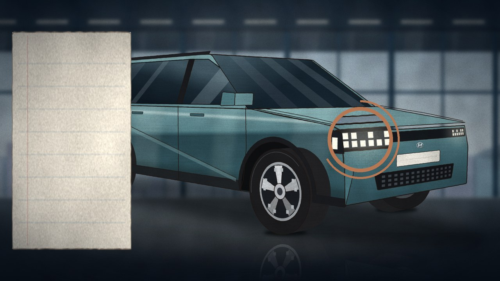
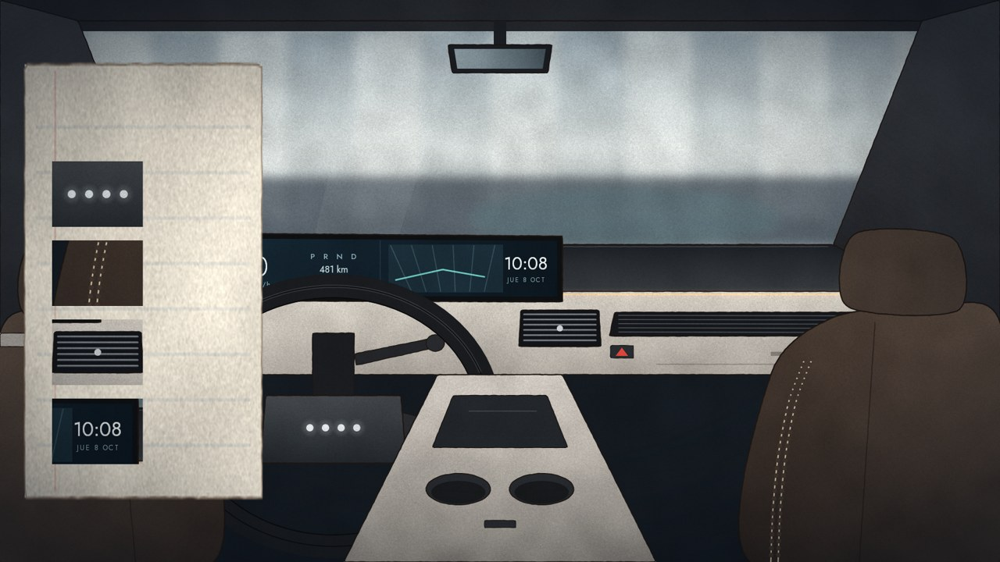
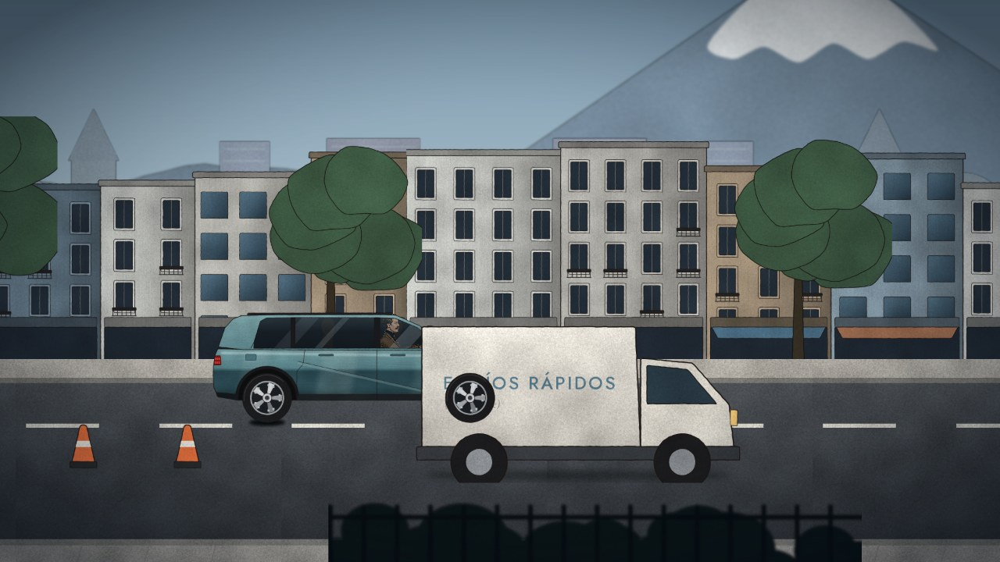
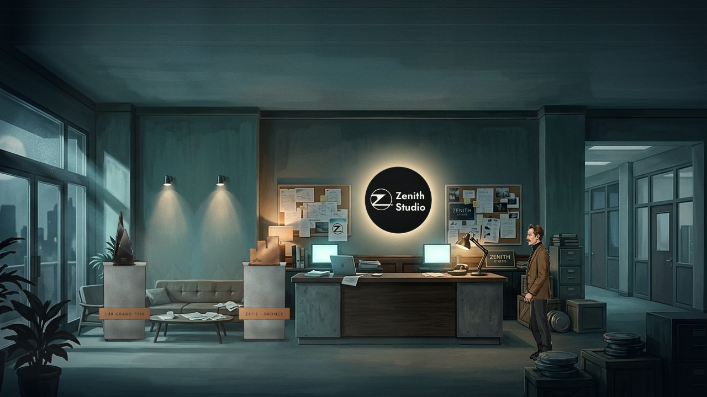
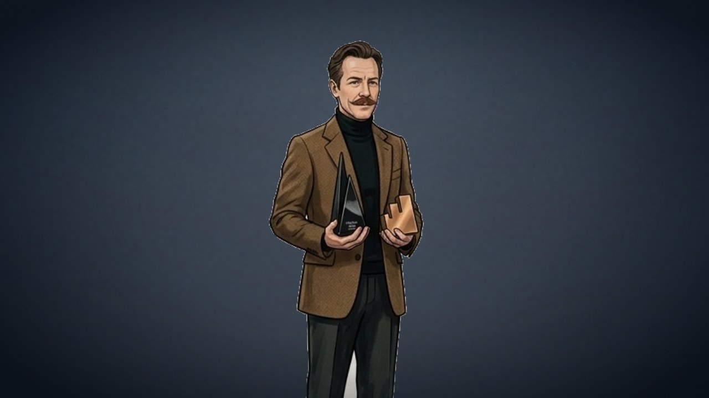

# THE TESTER — THE ULTIMATE TEST
*A Zenith Studio original game · CREATE BEYOND REAL*

A compact, cinematic 2D side-scrolling narrative game for **Unity 6**, starring **Jean Paul Tester**,
the impossibly meticulous automotive critic created by Zenith Studio for Hyundai. He tries, very
seriously, to find a single flaw in a Hyundai IONIQ 5. He fails. Then he receives two awards.

All narrative text and UI are in Spanish. Target play time for a first run is about 5 minutes.



> The images in `Docs/previews/` are composited **from the game's real art and level data** with the
> Python preview tool (no UI text, no runtime effects). They are **not** in-engine screenshots: Unity
> could not be run in the environment where this project was built (see *Verification status*).

---

## Quick start

> **Guía en español paso a paso (jugar en Unity o publicar un link web): [Docs/COMO_PROBAR.md](Docs/COMO_PROBAR.md).**

1. Install **Unity 6** (6000.0 LTS or newer) with **Web Build Support** if you want WebGL builds.
2. Unity Hub ▸ *Add project from disk* ▸ select this repository's folder. The project targets 6000.0.47f1;
   any newer Unity 6 version opens it (accept the upgrade).
3. On first load the editor script **The Tester ▸ Configurar proyecto** runs automatically: it checks the
   four scenes, adds them to *Build Settings* in order and applies the player/WebGL settings.
4. Press **The Tester ▸ ▶ Jugar desde el menú principal** (or open `Assets/TheTesterGame/Scenes/00_MainMenu.unity`
   and press Play).

Any of the four scenes can be played directly. Opening `02_TestDrive` or `03_ZenithStudio` alone in the
editor fakes the earlier tests (editor-only) so you can iterate on them. Use **The Tester ▸ Borrar partida
guardada** to reset the save.

### Controls

| Action | Keyboard / mouse | Touch |
|---|---|---|
| Walk | A / D or ← / → | on-screen arrows |
| Interact / inspect | E (or Enter) | action button |
| Move the magnifier | mouse (or WASD / arrows) | drag |
| Point at a detail (interior test) | click | tap |
| Accelerate / brake (hold brake again when stopped = reverse) | D / → · A / ← | pedals |
| Change lane | W / S or ↑ / ↓ | chevrons |
| Horn (contextual action) | Space | horn button |
| Skip the arrival intro | Space / Enter / E | action button |
| Pause | Esc (or P) | pause button |

---

## The game

| | |
|---|---|
| **Opening — the arrival.** A cinematic exterior of the Hyundai dealership. Jean Paul walks in: *“Dicen que nada es perfecto.”* … *“Jean Paul Tester está dispuesto a comprobarlo.”* |  |
| **Level 01 — showroom.** Explore a glass showroom (parallax city and Andes behind the windows, polished floor with reflections, foreground silhouettes). *PRESIONA E PARA INSPECCIONAR* at station 01. Optional deadpan observations: coffee, reception, brochure, the bronze IONIQ. |  |
| **Test 01 — exterior inspection.** A painted 3/4 close-up. A real magnifying lens (masked, magnified copy of the painting) follows the mouse/finger. Rest it on headlights, wheels, bodywork, door alignment and grille; each completion writes a note in his notebook. Then, back in the showroom, he adjusts his moustache: *“Interesante…”* |  |
| **Test 02 — the detail test.** Inside the cabin. The notebook shows magnified crops of four details (Morse “H” dots on the wheel, double stitching, six vent slats, the 10:08 clock); find and click each with the lens over it. Decoys earn dry remarks. He re-checks the dashboard, checks a detail twice, and produces a much larger magnifier: *“Esto es sospechoso.”* |  |
| **Level 03 — the test drive (≈50 s).** Quito-inspired city with Cotopaxi on the horizon. Accelerate, brake, stop at the red light, change lanes around a delivery van (*“ENVÍOS RÁPIDOS (casi siempre)”*), respect the 30 km/h school zone, park inside the box. No crashes: an automatic emergency brake (which he finds annoying) prevents collisions. Ends on a silent close-up: he adjusts his moustache, turns to the camera, raises an eyebrow, a reluctant smile. **PRUEBAS COMPLETADAS.** |  |
| **Final level — Zenith Studio.** Built from Zenith Studio's own concept painting of its office at night: a fixed, theatrical view of the lobby (windows on the city, lounge, reception desk with monitors, storyboard boards, film reels, the backlit **Z. Zenith Studio** sign, redrawn crisply from the supplied logo). The camera opens tight on the glowing sign and pulls back to reveal the room while Jean Paul walks in from behind the crates. Optional observations: storyboards, sign, desk, film reels. Two concrete pedestals hold the **LUX Grand Prix** and the **EFFIE Ecuador Bronze**; press E twice to receive them. |  |
| **Finale.** The front-facing close-up from the reference image of him holding both awards, in front of the defocused studio with the Zenith sign at his side. He looks at one, then the other, raises an eyebrow, a long awkward pause… and the tiniest approving smile. End screen: **ZENITH STUDIO · CREATE BEYOND REAL · THE TESTER — THE ULTIMATE TEST**, with *JUGAR DE NUEVO* and *VOLVER AL MENÚ*. |  |

Systems: main menu (play / continue / instructions / settings / credits), pause menu (resume / restart level /
settings / instructions / main menu), audio settings (music, ambience, effects), fullscreen toggle, objective
HUD, three-test progress indicator, contextual prompts, captions, letterboxed cinematics, film grain and
vignette, touch controls, and an automatic save at every checkpoint (*CONTINUAR* resumes at the last test).

---

## Project structure

```
Assets/
  References/                 your reference images (character sheets, awards, props, Hyundai + Zenith logos,
                              Zenith office concept painting)
  TheTesterGame/
    Scenes/                   00_MainMenu · 01_Showroom · 02_TestDrive · 03_ZenithStudio
    Scripts/
      Core/                   engine-independent rules (no UnityEngine): JSON, rig/clip math, progress & save
                              state, inspection session, detail puzzle, vehicle model, drive course, all Spanish lines
      Runtime/                MonoBehaviours (see map below)
      Editor/                 project setup, import rules, content validator, WebGL build
    Art/Resources/Art/        runtime textures (character atlases, cars, environments, props, inspection art)
    Art/Source/               art-pipeline inputs/extras kept for artists (not shipped in builds)
    Animations/Resources/     animation clips (tester_clips.json)
    Audio/Resources/Audio/    Music · Ambience · Sfx (OGG)
    Data/Resources/Data/      level layouts, rigs, car meta + inspection hotspots, interior puzzle data
    UI/Resources/UI/          UI art + fonts (Cormorant Garamond, Jost — SIL OFL)
    Tests/EditMode · PlayMode Unity Test Runner suites
    Prefabs/ · Materials/     (see the README in each: content is assembled at runtime from data)
  WebGLTemplates/TheTester/   responsive web page template (loader in Zenith colours)
Packages/manifest.json        Input System, uGUI, Test Framework, 2D Sprite
Tools/
  ArtPipeline/                Python: cuts the character rig from the reference sheet, paints every scene
  AudioPipeline/              Python: cuts the music cues from the soundtrack, synthesises ambiences and effects
  CompileCheck/               dotnet harness: compiles the C# against Unity reference assemblies + runs Core tests
  UnityMeta/                  writes .meta files with stable GUIDs and the scene files
Docs/previews/                composited previews of key moments
Docs/COMO_PROBAR.md           how to test (Spanish): Unity locally, or a web link built by GitHub Actions
.github/workflows/webgl.yml   CI: compile check + Core tests always; Unity WebGL build + GitHub Pages with a licence
```

### How it is built

Each scene file contains a single `SceneBootstrap` component. At runtime it creates the persistent
`GameManager` (audio, UI, input, save, scene flow) and the scene's **director**, which builds the level from
data (`Data/Levels/*.json`: parallax layers of painted sprites, gameplay markers, colliders) and runs the
scene script as coroutines. This keeps the scenes tiny and every placement editable as data, and lets the
same layouts be rendered by the Python preview tool.

Jean Paul is a **cut-out puppet** built from the provided turnaround sheet: head, eyebrow, moustache,
torso, upper arm, forearm, hand, thigh, shin and shoe were separated (with the hidden blazer/trouser areas
in-painted) and rigged on 20 bones. Clips (walk, idle breathing, look around, raise magnifier, examine,
skeptical eyebrow, moustache adjust, disappointed, impressed, receive award, hold awards, seated driving)
are keyframed data evaluated identically by Python (previews) and C# (game). The finale uses the
front-facing reference pose holding both awards, with expression variants (one raised eyebrow, glances,
blink, smile).

### Recommended components → implementation

| Brief | Implementation |
|---|---|
| GameManager | `Runtime/Bootstrap/GameManager.cs` |
| PlayerController2D | `Runtime/Character/PlayerController2D.cs` (Physics2D box-cast collision) |
| PlayerAnimationController | `Runtime/Character/RigAnimator.cs` + `TesterRig.cs` (+ `FrontRig.cs`) |
| InteractionSystem | `Runtime/Interaction/InteractionSystem.cs`, `Interactable.cs` |
| InspectionController / InspectionTarget | `Runtime/Inspection/ExteriorInspection.cs`, `DetailTest.cs`, `InspectionStage.cs`, `Magnifier.cs`; rules in `Core/Gameplay/InspectionSession.cs`, `DetailPuzzle.cs` |
| TestProgressManager | `Core/Gameplay/GameProgress.cs` |
| VehicleDrivingController | `Runtime/Driving/VehicleDrivingController.cs`; rules in `Core/Gameplay/VehicleModel.cs`, `DriveCourse.cs` |
| CameraController | `Runtime/Rendering/CameraController.cs`, `ParallaxLayer.cs` |
| SceneTransitionManager | `GameManager.GoTo` + `UIManager.FadeOut/FadeIn` |
| AwardsSequenceController | `Runtime/Awards/AwardsSequenceController.cs`, `HeldProp.cs` |
| UIManager | `Runtime/UI/UIManager.cs`, `UIManager.Menus.cs`, `TouchControls.cs` |
| AudioManager | `Runtime/Services/AudioManager.cs` |
| SaveManager | `Runtime/Services/SaveManager.cs` (PlayerPrefs; IndexedDB on the web) |
| Scene scripts | `Runtime/Directors/MainMenuDirector · ShowroomDirector · DriveDirector · ZenithDirector` |

---

## Web build (for the Zenith Studio website)

**The Tester ▸ Construir WebGL** builds to `Builds/WebGL/` with the custom template, Gzip compression and
*decompression fallback* (so it works on servers without special headers). From the command line:

```bash
Unity -batchmode -quit -projectPath . -executeMethod TheTester.EditorTools.TheTesterBuild.BuildWebGLBatch
```

Upload the contents of `Builds/WebGL/` and embed it, for example:

```html
<iframe src="/the-tester/index.html" style="width:100%; aspect-ratio:16/9; border:0" allow="fullscreen; autoplay"></iframe>
```

The page fills its frame; the game always keeps a 16:9 composition (bars in the midnight blue palette on other
shapes) and switches to touch controls on phones and tablets. For faster loads you can serve Brotli instead of
Gzip (*Player Settings ▸ Publishing Settings*) if your server sets `Content-Encoding` headers. Total texture data
is about 38 M texels (~38 MB in GPU memory with DXT compression); audio is ~3.4 MB (the music is about 2.3 MB).

### Automatic build and web link (GitHub Actions)

`.github/workflows/webgl.yml` runs on every push. Without any setup it runs the Core tests and the compile checks.
With a free Unity Personal licence stored as repository secrets (`UNITY_LICENSE` = contents of the `.ulf` file,
`UNITY_EMAIL`, `UNITY_PASSWORD`) it also builds the WebGL player with Unity 6 (GameCI, using
`TheTesterBuild.BuildWebGLBatch`), attaches it to the run as the `TheTester-WebGL` artifact and, once
*Settings ▸ Pages ▸ Source* is set to *GitHub Actions*, publishes it to
`https://renzsalvador8.github.io/PROYECTO-RENZ/`. It then runs the EditMode and PlayMode suites inside Unity.
Without the secrets the Unity jobs are skipped, not failed. Step-by-step (Spanish): `Docs/COMO_PROBAR.md`.

---

## Tests and verification

* **Core unit tests (40 tests)** — `dotnet test Tools/CompileCheck/CoreTests.csproj` (also available in the Unity
  Test Runner, EditMode). They cover the JSON reader, rig/clip data and **curve parity with the Python art
  pipeline**, every level/rig/clip/hotspot file and every sprite it references, save/progress rules, inspection
  dwell/decay, the detail puzzle, the vehicle model (top speed, braking, no-collision limit, reverse, lane changes)
  and a **full simulated test drive** (a careful driver parks in ≈53 s, inside the 45–60 s target; a reckless
  driver cannot crash and is penalised).
* **Compile check without Unity** — `Tools/CompileCheck/fetch_refs.sh`, then
  `dotnet build Tools/CompileCheck/Runtime.csproj` (legacy input) and
  `dotnet build Tools/CompileCheck/Runtime.csproj "-p:TTDefines=TT_INPUT_SYSTEM%3BENABLE_INPUT_SYSTEM%3BUNITY_EDITOR"`
  and `dotnet build Tools/CompileCheck/Editor.csproj`. All runtime, editor and test code compiles with zero
  warnings against Unity reference assemblies (2021.3 module stubs, uGUI, UnityEditor) and a signature-checked
  Input System stub.
* **In Unity** — Window ▸ General ▸ Test Runner:
  * EditMode: the Core tests plus `UnityContentTests` (every asset resolves through `Resources`, validator clean).
  * PlayMode: `FullPlaythroughTest` plays the whole game with simulated input — menu, arrival, all five exterior
    areas, all four interior details, the drive, both awards — and asserts the end screen appears.
  * **The Tester ▸ Validar contenido** checks every referenced sprite, clip, font and data file.

### Verification status (please read)

This project was produced in a cloud container **without the Unity Editor** (Unity's download servers were not
reachable), so nothing was run inside Unity and no WebGL build was produced there. The GitHub Actions workflow
above is the quickest way to get the first real Unity build and test run. What *was* verified:
the C# compiles cleanly against Unity reference assemblies (both input back-ends, editor and test code); all
40 Core tests pass; data files and asset references are consistent; and the art/composition was reviewed through
the Python compositor. The first run in Unity 6 is therefore the real integration test: open the project, let the
setup run, play from the menu, and run the PlayMode test. Reference assemblies come from Unity 2021.3, so an API
that changed only in Unity 6 could still surface there; the code avoids APIs deprecated in Unity 6 (e.g.
`FindObjectOfType`, `Rigidbody2D.velocity`), uses no custom shaders (default sprite material, so it also renders
under URP 2D), and builds scenes from code to avoid hand-authored editor assets.

---

## Regenerating art and audio

```bash
pip install numpy scipy pillow skia-python
cd Tools/ArtPipeline && python3 build_all.py      # ~2 min: rig, clips, cars, every scene, UI, levels
cd Tools/AudioPipeline && python3 synth.py        # ~20 s: ambiences and effects (needs ffmpeg)
cd Tools/AudioPipeline && python3 soundtrack.py   # ~10 s: the 4 music cues, cut from source/zenith_theme_master.ogg
python3 Tools/UnityMeta/generate_meta.py          # .meta files for any new asset
```

`Tools/ArtPipeline/preview.py` / `preview_states.py` / `render_doc_previews.py` composite level layouts and rig
poses exactly as the game lays them out — handy for art direction without opening Unity.

---

## Artwork and content to replace for production

* **Hyundai logo**: the client-supplied emblem + wordmark (`References/ref_hyundai_logo.jpg`, 431×350) is used on
  the showroom brand wall, the dealership fascia (title screen and arrival), the garage exit sign and as a chrome
  badge on the IONIQ 5. It was cleaned and upscaled from a small JPEG; a vector (SVG/AI) master would make the
  large brand wall perfectly sharp.
* **Zenith Studio**: the final level is the supplied office concept painting (1376×768, upscaled to 2048 px wide,
  ceiling extended, the two painted pedestals painted out, crates cut out as a foreground layer). A higher
  resolution or layered version of the painting would sharpen the camera reveal. The sign and the end screen use
  the supplied cream logo.
* **The IONIQ 5** is an original stylised construction (3D-projected in the art pipeline), recognisable but not a
  licensed model; a professional illustration of the official model would raise fidelity.
* **Jean Paul's rig** was separated programmatically from the 1376×768 turnaround sheet. A layered master (PSB with
  separate limbs at higher resolution) from the character artist would allow sharper close-ups — the finale close-up
  is limited to ~2× the sheet's resolution.
* **Environments** (showroom, cabin, city, studio) are procedurally painted in a consistent gouache/ink style; a
  painter could replace any piece 1:1 (same file names/sizes) without code changes.
* **The awards** are cut from the provided reference sheet.
* **Music**: the client's soundtrack (2:39, generated with Suno), cut into four cues with beat-aligned, measured loop points
  (`Tools/AudioPipeline/soundtrack.py`): the intro as the looping theme (menu, showroom, studio), the main groove
  as the drive loop, the post-breakdown hit as the *PRUEBAS COMPLETADAS* sting, and the climax with its natural
  ending for the finale and end screen. Commercial use depends on the Suno plan the track was generated under;
  please confirm the rights before publishing. If you hear vocals that clash with the subtitles, other sections
  can be chosen by editing the times in `soundtrack.py`.
* **Sound effects and ambiences** are original procedural syntheses (no samples). No voice acting.
* Fonts: Cormorant Garamond and Jost, SIL Open Font License (licences included next to the fonts).

© Zenith Studio. Character and story created by Zenith Studio for Hyundai.
